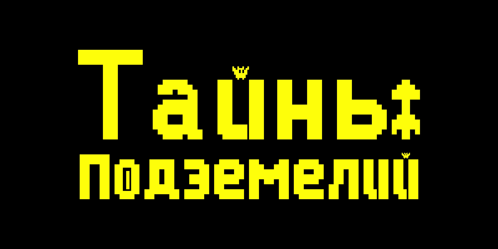

# Тайны подземелий (Mysteries of the Dungeons)

## Описание
**"Тайны подземелий"** — это 2D игра, выполненная в рето-стиле. В ней игрок управляет персонажем, преодавлевая перепятствия и собирая улучшения. При передвижении персонаж продолжает двигаться, пока не упрётся в стену. Цель игры — исследовать подземелья и преодолевать препятствия.

## Режимы игры
- Основной
Основной режим представляет перед собой 10 уровней. Каждый уровень содержит в себе одну комнату, из которой необходимо выбраться дойдя до телепорта и минуя все препаядствияю. Желательно по ходу продвижения собрать как можно больше монет и звёзд.

- Аркада
Бесконечный режим игры. Основной целью аркады является зайти как можно больше далеко, баллы начисляются за каждое собранное очко опыта и максимально достигнутой высоты. На пути протагониста ждут препятствия в виде ловушек и приближающегося цунами, из-за чего вернуться к началу невозможно.


## Установка

Чтобы установить "Тайны подземелий", выполните следующие шаги:

1. **Клонируйте репозиторий**
   ```bash
   git clone https://github.com/afkfishka/Tajny-podzemelij
   cd Tajny-podzemelij

2. **Установите необходимые зависимости**
   ```bash
   pip install -r requirements.txt

3. **Запустите игру**
   ```bash
   python lobby.py


## Управление

- Перемещение
Влево: ← или A
Вправо: → или D
Вверх: ↑ или W
Вниз: ↓ или S

- Активация бонусов
1 — Магнит
2 — Заморозка
3 — Щит

- Игровые моменты
Esc — Пауза

